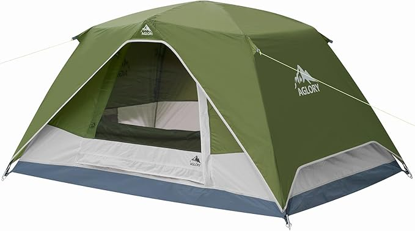
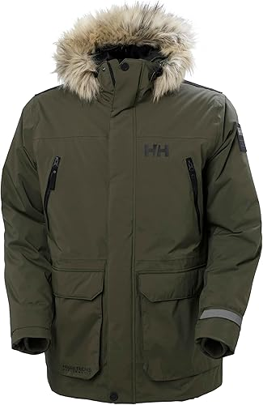
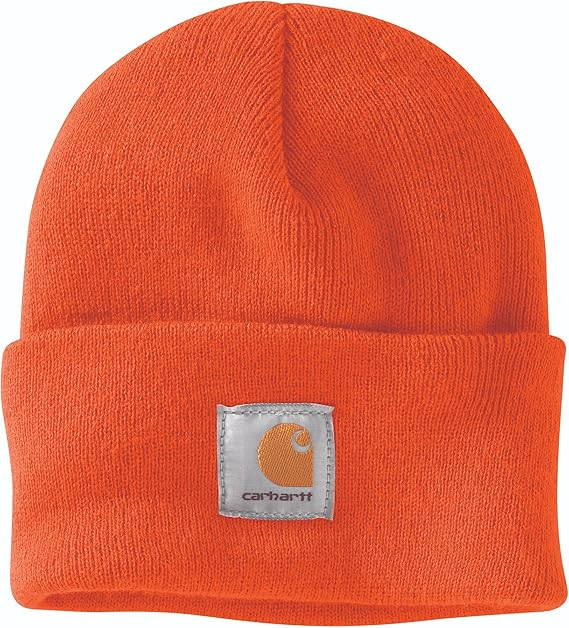
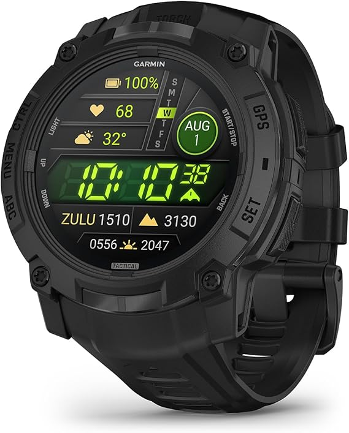
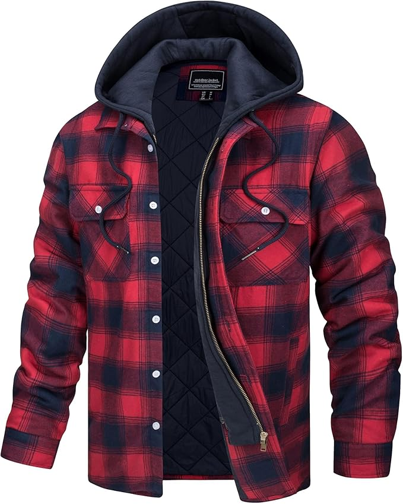
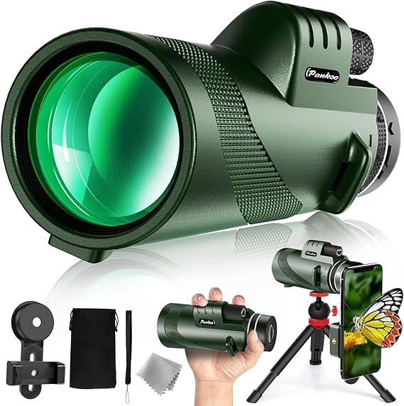
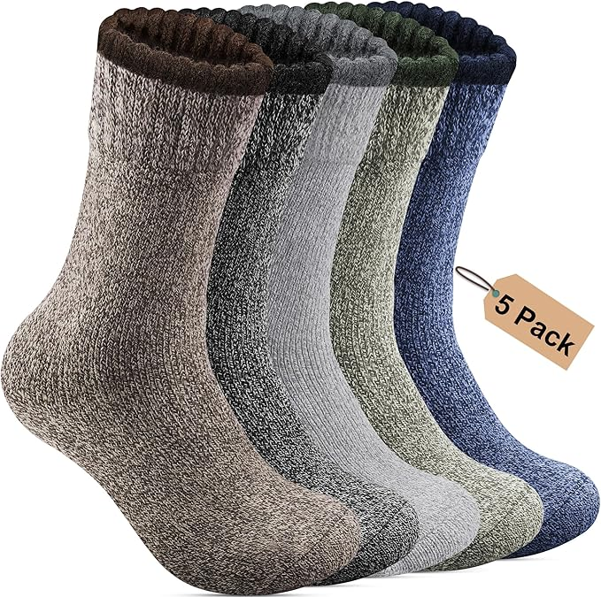
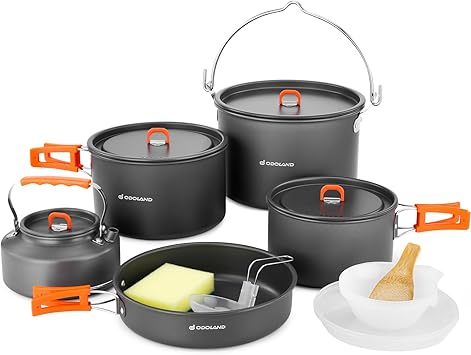

<!DOCTYPE html>
<html lang="en">
<head>
    <meta charset="UTF-8">
    <meta name="viewport" content="width=device-width, initial-scale=1.0">
    <title>Summit Supplies & Sales</title>

    
</head>

<body>

<header>
    <h1>Summit Supplies & Sales</h1>
    
Quality Products, Smart Prices

</header>

<nav>
    <a href="#home">Home</a>
    <a href="#products">Products</a>
    <a href="https://summit-supplies-sales.myshopify.com" target="_blank">Shop Now</a>
    <a href="#gallery">Photo Gallery</a>
</nav>

    <h1>Buy Now on Shopify!</h1>
    <a href="https://summit-supplies-sales.myshopify.com" target="_blank">Shop Now</a>

    <h2>Product Categories</h2>
    

        
Camping Gear

        
Outdoor Apparel

        
Electronics

        
Seasonal Deals

    

    <h2>Photo Gallery</h2>
    

        
        
        
        
        
        
        
        
        
        
        
    

    <h2>Terms & Conditions</h2>
    
Welcome to Summit Supplies & Sales. By accessing our website, you agree to comply with our terms.

    <h2>Privacy Policy</h2>
    
We respect your privacy. Personal information is used solely for order processing and customer service.

    <h2>Shipping & Returns</h2>
    
Orders are processed within 2–5 business days. Returns accepted within 14 days.

    <h2>Refund Policy</h2>
    
Refunds issued within 7 business days of receiving returned items.

    
Summit Supplies & Sales is owned and operated by Phillip Nasogaluak, providing quality products at smart prices.

<footer>
    
Summit Supplies & Sales © 2025

    

        <a href="#terms">Terms</a> |
        <a href="#privacy">Privacy</a> |
        <a href="#shipping">Shipping</a> |
        <a href="#refunds">Refunds</a>
    

</footer>

</body>
</html>

